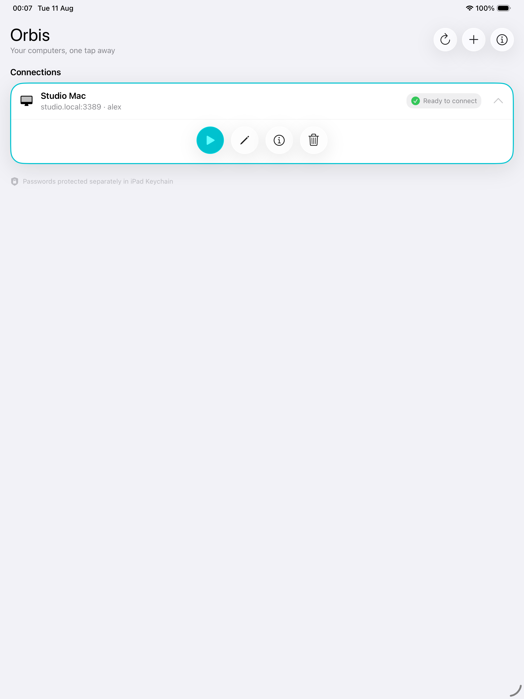
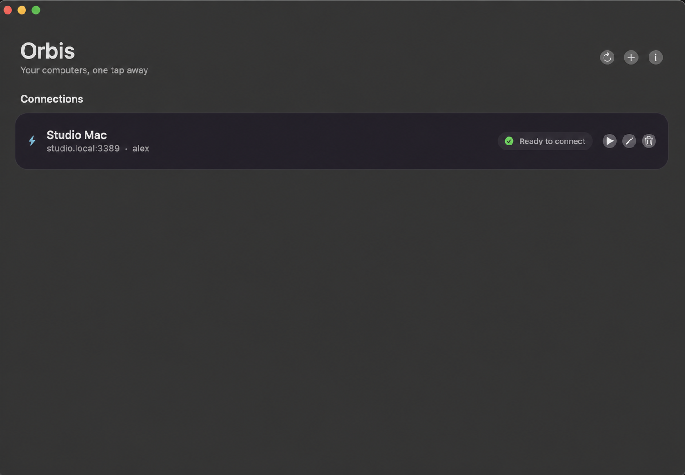

<p align="center">
  
</p>

<h1 align="center">Orbis</h1>

<p align="center">
  RDP for Linux, with Mac shortcuts that behave like Mac shortcuts.
</p>

Orbis is an RDP client for iPad and Mac. Use the shortcuts you already know
inside the remote session: ⌘C copies, ⌘V pastes, ⌘A selects all, ⌘Z undoes,
and ⌘⌫ sends Forward Delete.

| iPadOS | macOS |
| --- | --- |
|  |  |

## Why it exists

GNOME Remote Login exposed two problems with the clients I tried on Apple
devices. Some failed during the login handoff. Others connected, but made me
switch from Command to Control for basic editing.

Orbis handles that handoff and translates the Mac shortcuts before they reach
the Linux desktop. FreeRDP handles the RDP protocol. UIKit and AppKit provide
the connection library, profile editor, certificate prompts, and session
controls.

Direct RDP connections work too. GNOME Remote Login is simply the path that has
received the most testing so far.

## Keyboard mapping

The mapping is active only while the remote session has focus.

| Mac keyboard | Linux session |
| --- | --- |
| ⌘A/C/F/L/N/P/R/S/T/V/W/X/Z | Ctrl+A/C/F/L/N/P/R/S/T/V/W/X/Z |
| ⌘⌫ | Forward Delete |

On macOS, tapping Command on its own sends Super, which opens GNOME Activities.
On iPadOS, Command is kept as a shortcut modifier. Other keys use FreeRDP's
normal keyboard mapping.

## What works today

- Connections by IP address, local hostname, or public DNS name
- GNOME Remote Login and its sign-in handoff
- Profiles with optional automatic connection
- Per-profile certificate prompts or automatic certificate acceptance
- Passwords stored in Apple Keychain rather than in the profile
- Native-resolution sessions and full-screen macOS windows
- Apple Silicon, Intel, and universal macOS builds

The connection library is empty after installation. The `Studio Mac` profile in
the screenshots is documentation data, not a bundled connection.

## Supported systems

| App | Minimum OS | UI | Architectures |
| --- | --- | --- | --- |
| iPad | iPadOS 26 | UIKit | arm64 device and arm64 simulator |
| Mac | macOS 15 | AppKit | Apple Silicon, Intel, or universal |

Both apps use `com.dnexus.orbis`. Versions use the UTC build date:
`YYYY.MM.DD` for the version and `YYYYMMDD` for the build number.

## Build from source

Install Xcode, the Xcode command-line tools, CMake, and Ninja. FreeRDP is pinned
as a Git submodule, so clone it with the rest of the repository:

```sh
git clone --recurse-submodules https://github.com/j0nl1/orbis.git
cd orbis
```

Run the simulator build:

```sh
scripts/build-orbis-simulator.sh
```

For a connected iPad, provide your Apple development team and the device UDID:

```sh
APPLE_DEVELOPMENT_TEAM=YOUR_TEAM_ID \
  ORBIS_DEVICE_UDID=YOUR_IPAD_UDID \
  scripts/build-orbis-device.sh
```

Build for the current Mac:

```sh
scripts/build-orbis-macos.sh
```

Or produce one app containing both Mac architectures:

```sh
ORBIS_MACOS_ARCH=universal scripts/build-orbis-macos.sh
```

[ORBIS.md](ORBIS.md) covers device installation, all build options, keyboard
details, and private-network access through Cloudflare Tunnel.

## Permissions and passwords

Orbis asks for Local Network access when it connects to an address on your LAN.
It does not need Screen Recording or Accessibility access. The exact declarations
for each platform are documented in [docs/permissions.md](docs/permissions.md).

Passwords are stored as separate Keychain items. They do not appear in profile
files, screenshots, or build artifacts. Editing a profile without replacing its
password leaves the existing Keychain item untouched. Deleting the profile also
deletes that item.

## Repository layout

```text
ipados/   UIKit app and iPad session UI
macos/    AppKit app and Mac session UI
shared/   Profiles, Keychain storage, and acknowledgements
vendor/   pinned FreeRDP submodule
patches/  Orbis changes to the FreeRDP Apple adapters
scripts/  build and test commands
```

Builds export the pinned FreeRDP tree into `.build/`, apply the adapter patch,
and link the Orbis sources there. The submodule stays unchanged. The details are
in [docs/architecture/repository-layout.md](docs/architecture/repository-layout.md).

## Credits and license

FreeRDP and WinPR provide the RDP engine. Orbis also ships code from OpenSSL,
FFmpeg, OpenH264, Opus, libpng, libjpeg-turbo, libwebp, cJSON, and uriparser.
Their licenses and source links are listed in
[THIRD_PARTY_NOTICES.md](THIRD_PARTY_NOTICES.md) and inside the app.

Orbis application code is licensed under MIT. FreeRDP and the adapter patch
remain under Apache-2.0. See [LICENSE](LICENSE) and
[LICENSES/Apache-2.0.txt](LICENSES/Apache-2.0.txt).
